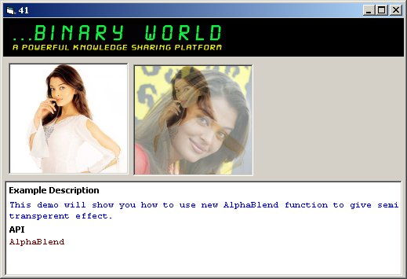



## Create Animated Semi\-Transperent image using AlphaBlend API

### Description

In this article we will see how to use new AlphaBlend API which is only available in win 2k and later , Win 98 and later. In this example we have function called DoAlphablend and this function takes 3 arguments : source picturebox, destination picture box and AlphaVal. Alphavalue determine the transparancy of image.

Visit ===> http://binaryworld.no-ip.info <=== for more than 3500 VB/VB.net/SQL server Artcles

And dont Miss our Exclusive API Dictionary at ===> http://binaryworld.no-ip.info/api.aspx <===
 
### More Info
 

             |
---                |---
**Submitted On**   |2004-08-23 12:14:04
**By**             |[Nayan Patel \(binaryworld\.net\)](https://github.com/Planet-Source-Code/PSCIndex/blob/master/ByAuthor/nayan-patel-binaryworld-net.md)
**Level**          |Intermediate
**User Rating**    |4.5 (18 globes from 4 users)
**Compatibility**  |VB 5\.0, VB 6\.0
**Category**       |[Graphics](https://github.com/Planet-Source-Code/PSCIndex/blob/master/ByCategory/graphics__1-46.md)
**World**          |[Visual Basic](https://github.com/Planet-Source-Code/PSCIndex/blob/master/ByWorld/visual-basic.md)
**Archive File**   |[Create\_Ani1785028232004\.zip](https://github.com/Planet-Source-Code/nayan-patel-binaryworld-net-create-animated-semi-transperent-image-using-alphablend-api__1-55773/archive/master.zip)

